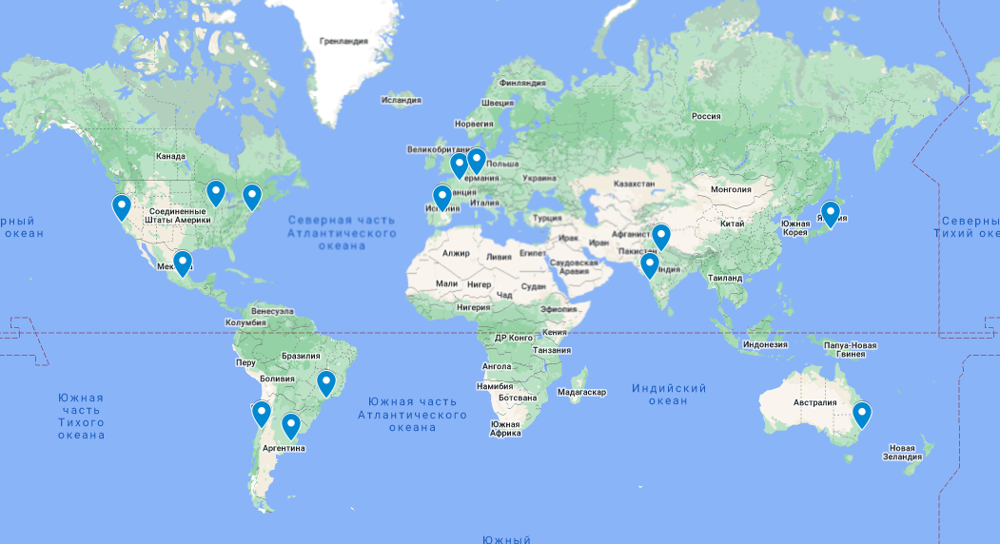
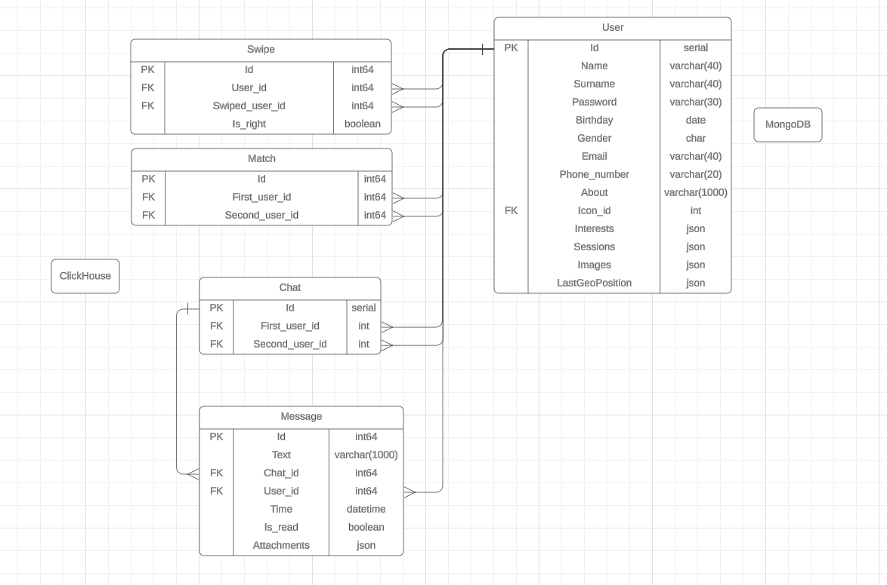
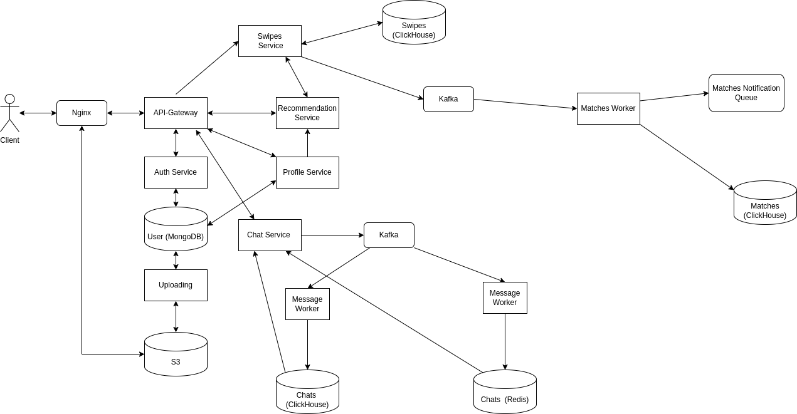

# Tinder

---

## Содержание

* ### [1. Тема, целевая аудитория](#1)
* ### [2. Расчет нагрузки](#2)
* ### [3. Глобальная балансировка](#3)
* ### [4. Локальная балансировка](#4)
* ### [5. Логическая схема БД](#5)
* ### [6. Физическая схема БД](#6)
* ### [7. Алгоритмы](#7)
* ### [8. Технологии](#8)
* ### [9. Обеспечение надёжности](#9)
* ### [10. Схема проекта](#10)
* ### [11. Расчет ресурсов](#11)

## 1. Тема и целевая аудитория

**Tinder** - популярное приложение для мобильных платформ Android и iOS, предназначенное для романтических знакомств в соответствии с заданными параметрами и с учётом геолокации. Основными действиями в приложении являются пролистывания — «свайпы» (проведение пальцем в горизонтальном направлении): пользователю показывают фотографии и краткие биографии кандидатов (имя и возраст), и пользователь может провести вправо, если считает совпадение удачным. Если два пользователя отметили друг друга как удачные совпадения, они могут начать общение и договориться о встрече.

## MVP

- Регистрация/Создание профиля
- Лента профилей
- Возможность ставить лайки и пропуски (свайпы)
- Загрузка фотографий
- Уведомления о совпадениях
- Чат

## Целевая аудитория

Согласно информации с сайта (https://www.businessofapps.com/data/tinder-statistics/)

- 75 миллионов активных пользователей в месяц
- 400 миллионов скачиваний

### Распределение по странам

| Страна            | Процент пользователей                 |
|-------------------|:-------------------------------------:|
| Соединенные Штаты |                 10.13                 |
| Бразилия          |                 9.7                   |
| Польша            |                 5.77                  |
| Испания           |                 5.28                  |
| Аргентина         |                 4.25                  |

## 2. Расчет нагрузки

### Продуктовые метрики

| Метрика                                      | Значение |
| -------------------------------------------- | -------- |
| Зарегистрированных пользователей             | 400 млн  |
| Месячная аудитория                           |  75 млн  |
| Суточная аудитория                           |  42 млн  |
| Среднее количество свайпов в день            | 1.6 млрд |
| Максимальное количество свайпов в день       | 3 млрд   |
| Совпадений в день                            | 50 млн   |

### Количество операций по типам

Количество свайпов на пользователя в день - `1.6 млрд / 42 млн = 38`   
Исходя из данных научной статьи (https://arxiv.org/pdf/1607.03320.pdf) можно вычислить, что в среднем пользователь отправляет около 9 сообщений в чат.  
Будем считать, что количество чатов в день примерно равно количеству совпадений.  
Количество сообщений в день - `9 * 2.75 = 24.75`  

Считаем, что пользователь меняет свою аватарку или одну из своих фото раз в месяц.

| Операция                         | Среднее кол-во в день на пользователя |
| -------------------------------- | :-----------------------------------: |
| Регистрация                      |                 0.0007                |
| Смена аватара                    |                 0.03                  |
| Свайпы(просмотр профилей)        |                  38                   |
| Совпадения                       |                  2.75                 |
| Отправка сообщения               |                  24.75                |
| Отправка вложения(гифки)         |                  0.28                 |
| Получение списка чатов           |                  4                    |
| Получение списка сообщений чата  |                  4                    |

### Технические метрики

#### Объем хранилища

Хранилище требуется для пользовательских данных (профилей) и хранения сообщений (также ещё нужно хранить информацию о свайпах, но её размером можно пренебречь).

Средний размер профиля пользователя включающим в себя персональные данные пользователя, никнейм и контактные данные равным 2 КБ. Размер фото в среднем равен 410 КБ (отображаются в клиенте размером 640*640 пикселей). Рекомендуется загружать примерно 5 фото.  

Средний размер хранилища на профиль - 2 КБ + 410 КБ * 5 = 2052 КБ , количество пользователей 400 млн => Размер хранилища на пользователей

`400 млн * 2052 КБ = 820 ТБ`

Среднюю длину сообщения, отправленного пользователем, будем считать равным 60 символов,
а размер символа - 2 байтам. Т.е. средний размер сообщения - 120 байт. За один день пользователь отправляет 25 сообщений. Переписки хранят полгода. => Размер хранилища сообщений

`75 млн * 120 байт * 25 * 180 = 40.5 ТБ`

Средний размер вложения(гифки) будем считать 10 МБ. В приложении отправляют 4.2 млн Gif в неделю. Приложение хранит переписки в течении полугода(примерно 25 недель) => Размер хранилища вложений

`75 млн * 10 МБ = 750 ТБ`

| Тип данных | Размер  |
| ---------- | ------- |
| Профили    | 820 Тб  |
| Сообщения  | 40.5 Тб |
| Вложения   | 750  Тб |

#### RPS

Учитывая 42 млн DAU: 
Считаем средний RPS по формуле: `42 млн * N / 24 / 3600`, где N - число операций определённого типа в день  
Считаем пиковый RPS, как 2 * средний RPS

| Операция                         | Средний RPS | Пиковый RPS |
| -------------------------------- | :---------: | :---------: |
| Регистрация                      |    0.33     |     0.66    |
| Смена аватара                    |     15      |      30     |
| Свайпы(просмотр профилей)        |    18 472   |    36 944   |
| Совпадения                       |     1337    |     2674    |
| Отправка сообщения               |    12 031   |    24 062   |
| Отправка вложения                |    137      |      274    |
| Получение списка чатов           |    1944     |     3888    |
| Получение списка сообщений чата  |    1944     |     3888    |
| **Сумма**                        | **41 227**  |  **82 454** |

#### Сетевой трафик

**Смена аватара(фото)**

Средний размер фото при отправке считаем равным 2 Mб.

**Регистрация**

Средний размер фото при отправке считаем равным 2 Mб. При регистрации отправляют примерно 5 фото и данные о себе примерно на 2 КБ.  
Общий объем данные при регистрации:  

`2 КБ + 2 Мб * 5 ~= 10 Мб`  

**Свайпы(просмотр профилей)**

Средний размер профиля пользователя считаем равным `2 КБ + 410 КБ * 5 = 2052 КБ` . Размером информации о свайпе можно пренебречь.

**Совпадения(уведомления)**

Будем считать, что после совпадения пользователь ещё раз просматривает профиль.

**Отправка сообщения**

Средний размер сообщения будем считать равным 120 байт.

**Отправка вложения**

Средний размер вложения будем считать равным 1 МБ.

**Получение списка чатов**

Считаем, что на каждый запрос пользователь получает информацию о 10 чатах,
при среднем размере аватара в 410 Кб имеем:
`10 * 410 = 4.1 МБ`

**Получение списка сообщений чата**

Считаем, что на каждый запрос пользователь получает последние 10 сообщений,
при среднем размере в 120 байт и среднем размере вложения в 1 Мб на один запрос имеем:  
`10 * (120 + 0.01 * 1e6) = 10 Кб`

**Трафик**

| Операция                    | Средний трафик, Гбит/с | Пиковый трафик, Гбит/с | Суточный трафик, Гбайт |
| ----------------------------| :--------------------: | :--------------------: | :--------------------: |
| Смена аватара(фото)         |          0.24          |          0.48          |          2 592         |
| Регистрация                 |          0.027         |          0.054         |          292           |
| Свайпы                      |          303           |          606           |       3 272 400        |
| Совпадения                  |          22            |          44            |         237 600        |
| Отправка сообщения          |          0.012         |          0.024         |          130           |
| Отправка вложения           |          1.1           |          2.2           |         95 040         |
| Получение списка чатов      |          64            |          128           |        168 480         |
| Получение списка сообщений  |          0.16          |          0.32          |         1728           |
| **Сумма**                   |       **372.94**       |       **745.88**       |     **3 588 182**      |

## 3. Глобальная балансировка нагрузки

### 3.1 Физическое расположение датацентров
+ Северная Америка - 4 ДЦ 
    - США (Нью-Йорк, Чикаго, Сан-Франциско)
    - Мексика (Мехико)
+ Южная Америка - 3 ДЦ 
    - Бразилия (Сан-Паулу)
    - Аргентина (Буэнос-Айрес)
    - Чили (Сантьяго)
+ Европа - 4 ДЦ 
    - Франция (Париж)
    - Великобритания (Лондон)
    - Германия (Франкфурт)
    - Испания (Мадрид)
+ Азия - 3 ДЦ 
    - Индия (Мумбаи, Дели)
    - Япония (Токио)
+ Австралия - 1 ДЦ  (Сидней)

Интерактивная карта: https://www.google.com/maps/d/edit?mid=1qLQRtAtQ3YvXZSvJlapSoeAva7ZfXsU&usp=sharing

Данные города были выбраны, исходя из списка стран, где чаще всего пользуются Tinder (https://worldpopulationreview.com/country-rankings/tinder-users-by-country)

### 3.2 Схема балансировки
- Определяем регион через Geo-based DNS, поскольку данный метод гарантирует подключение пользователей к ближайшему серверу, а значит минимальную задержку и минимальную перегрузку сети. Он подходит для таких компаний, как Tinder, которые имеют аудиторию по всему миру.
- В рамках региона выбираем датацентр через BGP Anycast
- Также существует схема перераспределения трафика в случае отказа датацентра. Например, если откажет датацентр в Сиднее, то трафик из Австралии будет направлен в датацентры в Токио и Мумбаи с учетом их текущей загрузки

## 4. Локальная балансировка нагрузки

### Схема балансировки

1. На входе в ДЦ ставим несколько роутеров. Роутеры могут использовать протокол HSRP.
2. Далее трафик проксируется на nginx, при этом маршруты к nginx анонсируются через BGP
3. nginx балансирует трафик на application-сервера по round-robin стратегии

HSRP был разработан компанией Cisco и обеспечивает автоматическое переключение на резервный роутер, если основной роутер выходит из строя. Это достигается путем создания виртуального роутера, который имеет свой собственный IP-адрес и MAC-адрес. Все узлы в сети настроены на использование этого виртуального роутера как своего шлюза по умолчанию.

### Kubernetes для оркестрации

Kubernetes будет использоваться для управления развертыванием и масштабированием приложений. Трафик будет направляться на поды следующим образом:

1. Создается Kubernetes Service, который будет действовать как балансировщик нагрузки для приложений. Service определяет маршруты к подам с использованием механизма Service Discovery.

2. Внутри кластера Kubernetes, kube-proxy будет перенаправлять трафик с Service на поды, используя стратегию балансировки sticky sessions.

### Нагрузка по терминации SSL

При такой схеме балансировки можно терминировать SSL на уровне nginx (с кешированием SSL-тикетов для улучшения производительности)

Пиковый RPS равен 82 454, суммарный пиковый трафик - 312.14 Гбит/с  
Пусть на датацентр приходится в среднем 20% запросов/трафика, тогда на один ДЦ приходится:

82 454 * 0.2 = 16 491 RPS    
312.14 * 0.2 = 62.428 Гбит/с

### Обеспечение отказоустойчивости

1. Несколько роутеров на входе в ДЦ
2. Несколько инстансов nginx
3. Следует выделить железо, способное выдержать 80% пикового трафика
4. Проводить e2e health checkи каждые 30 минут + Availability checks каждую минуту + Functional checks каждые 5 минут + проверки бд и кеша каждые 5 минут

## 5. Логическая схема БД

### Размер таблиц

**User**

| Поле              | Тип              | Размер, байт | Средний размер, байт |
| ----------------- | -----------------| :----------: | :------------------: |
| Id                | int64            |      8       |          8           |
| Name              | varchar(40)      |      40      |          10          |
| Surname           | varchar(40)      |      40      |          10          |
| Password          | varchar(30)      |      30      |          15          |
| Birthday          | date             |      3       |          3           |
| Gender            | char             |      1       |          1           |
| Email             | varchar(254)     |      254     |          254         |
| Phone_number      | varchar(15)      |      15      |          15          | 
| About             | varchar(1000)    |      1000    |          100         |
| Icon_id           | int64            |      8       |          8           |
| LastGeoPosition   | numeric(8,5) * 2 |      44      |          44          |
| **Сумма**         | -                |   **1443**   |         **468**      |

Размер одной записи - около 468 байт.

При размере аудитории в 75 млн пользователей получим общий объём таблицы: 32.6 Гб

**Session**

| Поле              | Тип          | Размер, байт |
| ----------------- | ------------ | :----------: |
| Cookie            | varchar(50)  |      50      |
| User_id           | int64        |      8       |
| **Сумма**         | -            |   **58**     |

Размер одной записи - около 58 байт.

Допустим, что кука выдается на сутки. При размере суточной аудитории в 42 млн пользователей получим общий объём таблицы: 2.3 Гб

**Interest**

| Поле              | Тип          | Размер, байт |
| ----------------- | ------------ | :----------: |
| Id                | int64        |      8       |
| Name              | varchar(40)  |      40      |
| **Сумма**         | -            |   **48**     |

Размер одной записи - около 48 байт.

В Tinder ecть 11 видов интересов. Размер таблицы - 528 байт.

**User_interest**

| Поле              | Тип          | Размер, байт |
| ----------------- | ------------ | :----------: |
| Id                | int64        |      8       |
| User_id           | int64        |      8       |
| Interest_id       | int64        |      8       |
| **Сумма**         | -            |   **24**     |

Размер одной записи - около 24 байт.

В среднем у одного пользователя 4 интереса. При размере аудитории в 75 млн пользователей получим общий объём таблицы: 286 Мб

**User_image**

| Поле              | Тип          | Размер, байт |
| ----------------- | ------------ | :----------: |
| Id                | int64        |      8       |
| User_id           | int64        |      8       |
| Image_path        | varchar(2048)|      2048    |
| **Сумма**         | -            |   **2064**   |

Размер одной записи - около 2064 байт.

В среднем у одного пользователя 5 фото. При размере аудитории в 75 млн пользователей получим общий объём таблицы: 720 Гб

**Swipe**

| Поле              | Тип          | Размер, байт |
| ----------------- | ------------ | :----------: |
| Id                | int64        |      8       |
| User_id           | int64        |      8       |
| Swiped_user_id    | int64        |      8       |
| Is_right          | boolean      |      1       |
| **Сумма**         | -            |   **25**     |

Размер одной записи - около 25 байт.

Предположим, что информация о свайпах хранится 3 месяца.

При среднем количестве свайпов в день 1.6 млрд получим общий объём таблицы: 3.3 Тб

**Match**

| Поле              | Тип          | Размер, байт |
| ----------------- | ------------ | :----------: |
| Id                | int64        |      8       |
| First_user_id     | int64        |      8       |
| Second_user_id    | int64        |      8       |
| **Сумма**         | -            |   **24**     |

Размер одной записи - около 24 байт.

Предположим, что информация о совпадениях хранится 3 месяца.

При среднем количестве совпадений в день 50 млн получим общий объём таблицы: 100 Гб

**Chat**

| Поле              | Тип          | Размер, байт |
| ----------------- | ------------ | :----------: |
| Id                | int64        |      8       |
| First_user_id     | int64        |      8       |
| Second_user_id    | int64        |      8       |
| **Сумма**         | -            |   **24**     |

Размер одной записи - около 24 байт.

Информация о чатах хранится полгода.

Будем считать что каждый день появляется 50 млн чатов. Тогда общий объем таблицы: 402 Гб

**Message**

| Поле              | Тип          | Размер, байт |
| ----------------- | ------------ | :----------: |
| Id                | int64        |      8       |
| Text              | varchar(1000)|      1000    |
| Chat_id           | int64        |      8       |
| User_id           | int64        |      8       |
| Time              | datetime     |      8       |
| Is_read           | boolean      |      1       |
| **Сумма**         | -            |   **1032**   |

Следует учитывать что средний размер сообщения около 50 символов.

Размер одной записи - около 83 байт.

В среднем в одном чате хранится около 20 сообщений. Тогда общий объем таблицы: 13 Тб

**Attachment**

| Поле              | Тип          | Размер, байт |
| ----------------- | ------------ | :----------: |
| Id                | int64        |      8       |
| Type              | varchar(20)  |      20      |
| Path              | varchar(50)  |      2048    |
| Message_id        | int64        |      8       |
| **Сумма**         | -            |   **2084**   |

Размер одной записи - около 2084 байт.

В приложении отправляют 4.2 млн вложений в неделю. Приложение хранит переписки в течении полугода.

Тогда общий объем таблицы: 200 Гб

### Сводка:

| Таблица             | Размер одной строки | Кол-во строк | Общий размер | Нагрузка на чтение(RPS) | Нагрузка на запись(RPS) |
| ------------------- | ------------------- | ------------ | ------------ | ------------------ | ------------------ |
| User                | 468 Байт            | 75 млн       | 32.6 Гб      | 39618              | 0.66               |
| Session             | 58 Байт             | 42 млн       | 2.3 Гб       | 82180              | 486.11             |
| Interest            | 48 Байт             | 11           | 528 байт     | 39618              | 0                  |
| User_interest       | 24 Байта            | 300 млн      | 286 Мб       | 39618              | 0.66               |
| User_image          | 2064 Байт           | 375 млн      | 720 Гб       | 47394              | 30.66              | 
| Swipe               | 25 Байт             | 288 млрд     | 3.3 Тб       | 2674               | 36944              |
| Match               | 24 Байта            | 9 млрд       | 100 Гб       | 2674               | 2674               |
| Chat                | 24 Байта            | 9 млрд       | 201 Гб       | 3888               | 2674               |
| Message             | 83 Байта            | 180 млрд     | 13 Тб        | 3888               | 24062              |
| Attachment          | 2084 Байт           | 105 млн      | 200 Гб       | 3888               | 274                |

## 6. Физическая схема БД

### Денормализация схемы БД

Для избежания большого количества join'ов можно:

1. Добавить список интересов сразу в User
2. Добавить информацию о текущих сессиях сразу в User
3. Добавить список фото сразу в User
4. Добавить информацию о вложениях сразу в Message

Выбор MongoDB для профилей с вложенной структурой оправдан благодаря гибкости схемы, производительности и удобству работы с вложенными документами.  

MongoDB vs Cassandra  

Cassandra менее гибкая в плане схемы по сравнению с MongoDB  
Выбор ClickHouse оправдан высокой производительностью при работе с большими объемами данных и низкой задержки при операциях чтения. 

ClickHouse vs Elasticsearch  

В Elasticsearch более высокая стоимость хранения  

### Партиционирование ClickHouse

- Таблица Swipe: партиционирование по User_id  
Сохранять сообщения батчами по 10 млн строк. 
В день происходит примерно 1.6 млрд свайпов и свайпы хранятся 3 месяца. Получается `1.6 млрд * 90 = 144 млрд свайпов`.  
`144 млрд / 10 млн ~= 14400 партиций`  
На ClickHouse будет выделено примерно 10 серверов, на каждом из которых будет примерно 14400 партиций.  
- Таблица Message: партиционирование по Chat_id и Time
Сохранять сообщения батчами по 10 млн строк с учетом того, чтобы они хранились вместе со своим чатом.
В день делается примерно 1.04 млрд сообщений. Сообщения хранятся в среднем полгода. Получается `1.04 млрд * 180 = 187 млрд сообщений`.  
`187 млрд / 10 млн ~= 18700 партиций`  
На ClickHouse будет выделено примерно 10 серверов, на каждом из которых будет примерно 18700 партиций. 

### Redis Cluster

- В качестве буфера для хранения данных можно использовать Kafka. Будут два воркера: один будет сохранять сообщения в Redis и моментально отображать, а второй будет объединять их в пакеты и класть в ClickHouse.
- Данные будут разделены на слоты по Chat_id. В Redis может храниться до 20 млн сообщений и всегда 16384 слота. 

### Хранилище файлов 

Фото пользователей и прикрепленные файлы к сообщениям можно хранить в собственном S3 хранилище.
Размер файлов: 1514 Тб

### Схема резервного копирования

Для всех таблиц делать резервные копии раз в месяц + делать инкрементные копии каждый день. Replecation factor уместно сделать равным 3.

Репликация MongoDB: репликационный набор, состоящий из трех узлов: один первичный узел, который обрабатывает все записи и чтения, и два вторичных узла, которые зеркалируют данные первичного узла + автоматическое переключение на вторичный узел в случае сбоя первичного узла 

Репликация ClickHouse: настроить 2 реплики и использовать их для чтения

Репликация Redis: 2 реплики на каждый мастер (общий кластер из 16384 узлов: 5461 мастер и 10 922 реплики)

## 7. Алгоритмы

- Глобальная балансировка нагрузки осуществляется следующим образом: определение региона пользователя происходит через Geo-based DNS, а внутри региона выбор оптимального дата-центра происходит с помощью BGP Anycast. Это позволяет маршрутизировать трафик пользователей к ближайшим и наименее загруженным серверам, обеспечивая высокую доступность и производительность платформы.  
- На уровне локальной балансировки нагрузки, nginx выступает в качестве распределителя трафика, перенаправляя запросы пользователей на группу application-серверов по алгоритму round-robin.  
- При регистрации новых пользователей вся информация о них записывается в базу данных MongoDB, обеспечивая надежное хранение и быстрый доступ к профильным данным.  
- Для эффективной загрузки ленты для свайпов, алгоритм подбирает пользователей батчами по 50 человек, учитывая их приближенную геопозицию и пол. Геопозиция каждого пользователя хранится только в обобщенном виде и удаляется при длительном отсутствии активности, поддерживая актуальность данных. Таким образом, свайпы будут происходить среди пользователей с похожим местоположением. Кроме того, в ленту с высокой вероятностью (80%) добавляются люди, которым текущий пользователь уже понравился (свайпнул вправо).  
- В случае взаимной симпатии (совпадения свайпов) оба пользователя получают уведомление и они могут начать чат. Сообщения чатов сохраняются с использованием партиционирования по Chat_id и Time, что позволяет эффективно хранить данные в батчах, группируя сообщения по соответствующим чатам.  
- Для буферизации данных сообщений чатов перед их сохранением в базу данных используется Kafka, обеспечивающая надежную очередь сообщений и высокую пропускную способность.

## 8. Технологии

| Технология    | Область применения                              | Мотивационная часть                              |
| --------------| ------------------------------------------------| ------------------------------------------------ |
| Go            | ЯП Backend'а                                    | Надёжность, скорость, простая асинхронная модель |
| React, Vue.js | Frontend                                        | Гибкость, высокая скорость разработки            |
| nginx         | Reverse proxy, балансировщик                    | Скорость, гибкость, конфигурируемость            |
| MongoDB       | БД для данных пользователей                     | Масштабируемость, высокая скорость, гибкость     | 
| ClickHouse    | БД для хранения свайпов, совпадений и чатов     | Масштабируемость, высокая скорость               |
| Redis         | БД для временного хранения сообщений            | Масштабируемость, высокая скорость               |
| Prometheus    | Сбор метрик, их хранение                        | Стандарт индустрии                               |
| Grafana       | Визуализация собранных метрик                   | Лидер индустрии                                  |
| S3            | Хранилище пользовательских файлов               | Уменьшение задержки и исходящего трафика         |
| Kafka         | Брокер сообщений                                | Скорость, масштабируемость                       |

### ЯП Backend'а

Go vs Python  

Go быстрее и эффективнее Python, особенно для задач, связанных с CPU. Go предоставляет легковесные горутины и каналы, что облегчает параллельную обработку задач и асинхронную программирование без особой сложности.

### Frontend

React vs Angular  

React более легкий и гибкий, чем Angular, с меньшими затратами на обучение (а значит более высокой скоростью разработки) и более обширной экосистемой.

Vue.js - Комплексный фреймворк, прост в изучении 

### Балансировщик

nginx vs Apache  

nginx быстрее и легче Apache, занимает меньше места и обеспечивает лучшую производительность при высоких нагрузках.

### БД для данных пользователей

MongoDB идеально подходит для хранения данных, которые имеют переменную структуру включающих в себя ассоциативные массивы, что характерно для профиля пользователя.

### БД для хранения свайпов, совпадений и чатов

ClickHouse идеально подходит для аналитических нагрузок, таких как свайпы и совпадения.

### БД для временного хранения сообщений 

Redis подходит для данных, к которым требуется высокая скорость доступа.

## 9. Обеспечение надёжности

| Раздел                 | Обеспечение надёжности                                                                                      | 
| -----------------------| ------------------------------------------------------------------------------------------------------------| 
| ДЦ                     | Дублирование всех критических компонентов, разнесение их по разным помещениям                               |
| Локальная балансировка | Несколько роутеров на входе в ДЦ, несколько инстансов nginx                                                 |
| MongoDB                | Репликация данных                                                                                           |
| ClickHouse             | Репликация данных + горячее резервирование                                                                  |
| Kafka                  | Репликация данных                                                                                           |
| Redis                  | Репликация данных  + кластеризация                                                                                         |
| S3 хранилище           | Репликация данных + расположение серверов в двух различных помещениях и соединение их "растянутым" кластером|

Репликация MongoDB: репликационный набор, состоящий из трех узлов: один первичный узел, который обрабатывает все записи и чтения, и два вторичных узла, которые зеркалируют данные первичного узла + автоматическое переключение на вторичный узел в случае сбоя первичного узла 

Репликация ClickHouse: настроить 2 реплики и использовать их для чтения

Горячее резервирование ClickHouse: использование репликации вместе с распределёнными таблицами (создать распределённую таблицу для объединения данных из всех реплик)

Репликация Redis: 2 реплики на каждый мастер

Репликация Kafka: Replication factor = 3 (каждый раздел будет храниться на 3 брокерах). Квота ISR = 2 ( минимальное количество реплик, которые должны быть синхронизированы для успешного подтверждения записи)

## 10. Схема проекта

- Определяем регион через Geo-based DNS. В рамках региона выбираем датацентр через BGP Anycast. Все базы локальны для одной зоны(датацентра).
- API-Gateway балансирует запросы/соединения между микросервисами и авторизует пользователей через AuthService
- Recommendation Service генерирует ленту для свайпов на основании информации о геолокации и о предыдущих свайпах (не показывает пользователю людей, которых он уже свайпал + подмешивает людей, которые лайкнули его)
- Swipes Service обрабатывает свайпы и кладет их в базу. После по ним проходится Matches Worker и, анализируя свайпы, находит совпадения и формирует очередь для отложенных уведомлений
- Chat Service занимается обработкой сообщений. В качестве буфера для хранения сообщений используется Kafka. Будут два воркера: один будет сохранять сообщения в Redis и моментально отображать, а второй будет объединять их в пакеты и класть в ClickHouse.

## 11. Расчет ресурсов

### Нагрузка на сервисы

Пусть кука пользователю выдается в среднем 1 раз в день. В таком случае пиковый RPS для Auth Service - около 972 

| Сервис                 | пиковый RPS | CPU cores |RAM     |
| -----------------------| ----------- | --------- | ------ |
| Auth Service           | 972         | 10        | 10 ГБ  |
| Profile Service        | 36975       | 370       | 370 ГБ |
| Swipes Service         | 36944       | 370       | 370 ГБ |
| Recommendation Service | 36944       | 370       | 370 ГБ |
| Chat Service           | 32112       | 330       | 330 ГБ |
| Photo Uploading        | 304         | 30        | 30 ГБ  |
| API Gateway            | 70059       | 700       | 700 ГБ |

### Нагрузка на хранилища и СУБД

Так как все данные дублируются, общий объём диска умножим на 3

| Хранилище       | Объём диска | пиковый RPS на чтение | Пиковый RPS на запись | CPU cores | RAM    | Нагрузка на чтение | Нагрузка на запись    |
| --------------- | ----------- | --------------------- | --------------------- | --------- | ------ | ------------------ | --------------------- |
| MongoDB         | 100 ГБ      | 39618                 | 1                     | 396       | 396 ГБ | 650 Гбит / c       | 0.054 Гбит/c          |
| ClickHouse      | 49 ТБ       | 17012                 | 66574                 | 665       | 665 ГБ | 128 Гбит / c       | 664 Мбит на один батч |   
| Redis           | 200 ГБ      | 2674                  | 2674                  | 2         | 32 ГБ  | 24 Мбит / с        | 24 Mбит / c           |
| S3              | 1514 ТБ     | 51282                 | 305                   | 512       | 512 ГБ | 606 Гбит / c       | 3 Гбит / c            | 

### Балансировка

Согласно [бенчмарку](https://www.nginx.com/blog/testing-the-performance-of-nginx-and-nginx-plus-web-servers/) оптимальнее всего покупать машины с 24 ядрами. Каждая машина обрабатывает около 10 000 RPS. Всего понадобится 7 машин.

## Конфигурация серверов

Определяем конфигурацию машин для каждого сервиса. Так как все сервисы, кроме СУБД и хранилища, живут в Kubernetes, для них можно закупать одинаковые машины

| Сервис     | Хостинг | Конфигурация                                             | Cores | Cnt | Покупка, $ (1 шт) | Амортизация, $/мес (сумма, на 5 лет) |
| ---------- | ------- | -------------------------------------------------------- | ----- | --- | ----------------- | ------------------------------------ |
| kube node  | own     | 2xAMD EPYC 7002P/1x64GB/3200MHz DDR4/1xNVMe256GB         | 64    | 11  | 9 000             | 150                                  |
| MongoDB    | own     | 2xAMD EPYC 7002P/11x64GB/3200MHz DDR4/1xNVMe128GB        | 64    | 7   | 9 000             | 150                                  |
| ClickHouse | own     | 2xAMD EPYC 7H12/2x32GB/3200MHz DDR4/12x4TBNVMe           | 64    | 11  | 16 000            | 267                                  |
| Redis      | own     | 1xIntel Xeon E-2388G/1x32GB/3200MHz DDR4/2x240GB SATA SSD| 8     | 1   | 2 150             | 36                                   |
| S3         | own     | 2xAMD EPYC 7742/2x32GB/8xNVMe8T/3200MHz DDR4/1x115TBNVMe | 64    | 14  | 34 000            | 567                                  |

# Источники
- https://roast.dating/blog/tinder-statistics 
- https://www.enterpriseappstoday.com/stats/tinder-statistics.html 
- https://datingzest.com/tinder-statistics/
- https://marketsplash.com/ru/statistika-tinder/ 
