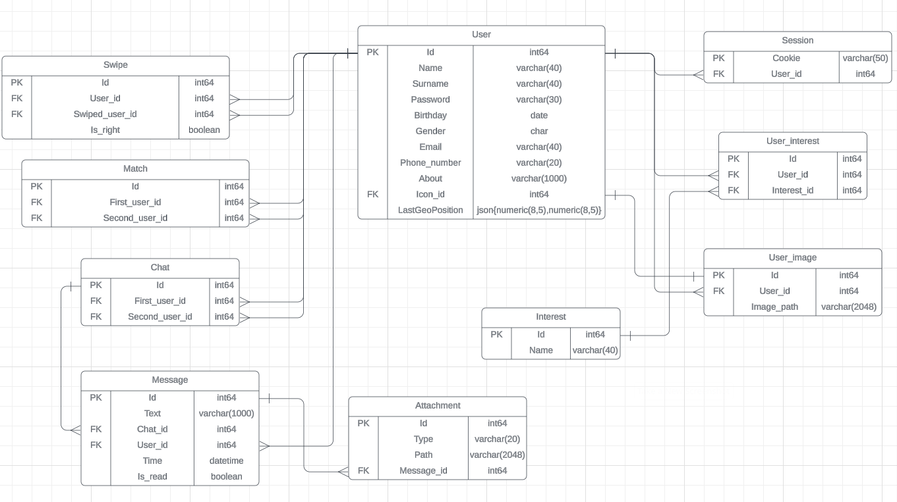

# Tinder

---

## 1. Тема и целевая аудитория

**Tinder** - популярное приложение для мобильных платформ Android и iOS, предназначенное для романтических знакомств в соответствии с заданными параметрами и с учётом геолокации. Основными действиями в приложении являются пролистывания — «свайпы» (проведение пальцем в горизонтальном направлении): пользователю показывают фотографии и краткие биографии кандидатов (имя и возраст), и пользователь может провести вправо, если считает совпадение удачным. Если два пользователя отметили друг друга как удачные совпадения, они могут начать общение и договориться о встрече.

## MVP

- Регистрация/Создание профиля
- Лента профилей
- Возможность ставить лайки и пропуски (свайпы)
- Загрузка фотографий
- Уведомления о совпадениях
- Чат

## Целевая аудитория

Согласно информации с сайта (https://www.businessofapps.com/data/tinder-statistics/)

- 75 миллионов активных пользователей в месяц
- 400 миллионов скачиваний

### Распределение по странам

| Страна            | Процент пользователей                 |
|-------------------|:-------------------------------------:|
| Соединенные Штаты |                 10.13                 |
| Бразилия          |                 9.7                   |
| Польша            |                 5.77                  |
| Испания           |                 5.28                  |
| Аргентина         |                 4.25                  |

## 2. Расчет нагрузки

### Продуктовые метрики

| Метрика                                      | Значение |
| -------------------------------------------- | -------- |
| Зарегистрированных пользователей             | 400 млн  |
| Месячная аудитория                           |  75 млн  |
| Суточная аудитория                           |  42 млн  |
| Среднее количество свайпов в день            | 1.6 млрд |
| Максимальное количество свайпов в день       | 3 млрд   |
| Совпадений в день                            | 50 млн   |

### Количество операций по типам

Количество свайпов на пользователя в день - `1.6 млрд / 42 млн = 38`   
Исходя из данных научной статьи (https://arxiv.org/pdf/1607.03320.pdf) можно вычислить, что в среднем пользователь отправляет около 9 сообщений в чат.  
Будем считать, что количество чатов в день примерно равно количеству совпадений.  
Количество сообщений в день - `9 * 2.75 = 24.75`  

Считаем, что пользователь меняет свою аватарку или одну из своих фото раз в месяц.

| Операция                         | Среднее кол-во в день на пользователя |
| -------------------------------- | :-----------------------------------: |
| Регистрация                      |                 0.0007                |
| Смена аватара                    |                 0.03                  |
| Свайпы(просмотр профилей)        |                  38                   |
| Совпадения                       |                  2.75                 |
| Отправка сообщения               |                  24.75                |
| Отправка вложения(гифки)         |                  0.28                 |
| Получение списка чатов           |                  4                    |
| Получение списка сообщений чата  |                  4                    |

### Технические метрики

#### Объем хранилища

Хранилище требуется для пользовательских данных (профилей) и хранения сообщений (также ещё нужно хранить информацию о свайпах, но её размером можно пренебречь).

Средний размер профиля пользователя включающим в себя персональные данные пользователя, никнейм и контактные данные равным 2 КБ. Размер фото в среднем равен 410 КБ (отображаются в клиенте размером 640*640 пикселей). Рекомендуется загружать примерно 5 фото.  

Средний размер хранилища на профиль - 2 КБ + 410 КБ * 5 = 2052 КБ , количество пользователей 400 млн => Размер хранилища на пользователей

`400 млн * 2052 КБ = 820 ТБ`

Среднюю длину сообщения, отправленного пользователем, будем считать равным 60 символов,
а размер символа - 2 байтам. Т.е. средний размер сообщения - 120 байт. За один день пользователь отправляет 25 сообщений. Переписки хранят полгода. => Размер хранилища сообщений

`75 млн * 120 байт * 25 * 180 = 40.5 ТБ`

Средний размер вложения(гифки) будем считать 10 МБ. В приложении отправляют 4.2 млн Gif в неделю. Приложение хранит переписки в течении полугода(примерно 25 недель) => Размер хранилища вложений

`75 млн * 10 МБ = 750 ТБ`

| Тип данных | Размер  |
| ---------- | ------- |
| Профили    | 820 Тб  |
| Сообщения  | 40.5 Тб |
| Вложения   | 750  Тб |

#### RPS

Учитывая 42 млн DAU: 
Считаем средний RPS по формуле: `42 млн * N / 24 / 3600`, где N - число операций определённого типа в день  
Считаем пиковый RPS, как 2 * средний RPS

| Операция                         | Средний RPS | Пиковый RPS |
| -------------------------------- | :---------: | :---------: |
| Регистрация                      |    0.33     |     0.66    |
| Смена аватара                    |     15      |      30     |
| Свайпы(просмотр профилей)        |    18 472   |    36 944   |
| Совпадения                       |     1337    |     2674    |
| Отправка сообщения               |    12 031   |    24 062   |
| Отправка вложения                |    137      |      274    |
| Получение списка чатов           |    1944     |     3888    |
| Получение списка сообщений чата  |    1944     |     3888    |
| **Сумма**                        | **41 227**  |  **82 454** |

#### Сетевой трафик

**Смена аватара(фото)**

Средний размер фото при отправке считаем равным 500 КБ.

**Регистрация**

Средний размер фото при отправке считаем равным 500 КБ. При регистрации отправляют примерно 5 фото и данные о себе примерно на 2 КБ.  
Общий объем данные при регистрации:  

`2 КБ + 500 КБ * 5 = 2502 КБ`  

**Свайпы(просмотр профилей)**

Средний размер профиля пользователя считаем равным 412 КБ. Размером информации о свайпе можно пренебречь.

**Совпадения(уведомления)**

Будем считать, что после совпадения пользователь ещё раз просматривает профиль.

**Отправка сообщения**

Средний размер сообщения будем считать равным 120 байт.

**Отправка вложения**

Средний размер вложения будем считать равным 10 МБ.

**Получение списка чатов**

Считаем, что на каждый запрос пользователь получает информацию о 10 чатах,
при среднем размере аватара в 410 Кб имеем:
`10 * 410 = 4.1 МБ`

**Получение списка сообщений чата**

Считаем, что на каждый запрос пользователь получает последние 10 сообщений,
при среднем размере в 120 байт и среднем размере вложения в 10 Мб на один запрос имеем:  
`10 * (120 + 0.01 * 10e6) = 1.001 Мб`

**Трафик**

| Операция                    | Средний трафик, Гбит/с | Пиковый трафик, Гбит/с | Суточный трафик, Гбайт |
| ----------------------------| :--------------------: | :--------------------: | :--------------------: |
| Смена аватара(фото)         |          0.06          |          0.12          |          648           |
| Регистрация                 |          0.007         |          0.014         |          76            |
| Свайпы                      |          61            |          122           |        658 800         |
| Совпадения                  |          4.4           |          8.8           |         47 520         |
| Отправка сообщения          |          0.012         |          0.024         |          130           |
| Отправка вложения           |           11           |           22           |        950 400         |
| Получение списка чатов      |           64           |          128           |        168 480         |
| Получение списка сообщений  |           15.6         |          31.2          |        691 200         |
| **Сумма**                   |       **156.07**       |       **312.14**       |     **2 517 254**      |

## 3. Глобальная балансировка нагрузки

### 3.1 Физическое расположение датацентров
+ Северная Америка - 4 ДЦ 
    - США (Нью-Йорк, Чикаго, Сан-Франциско)
    - Мексика (Мехико)
+ Южная Америка - 3 ДЦ 
    - Бразилия (Сан-Паулу)
    - Аргентина (Буэнос-Айрес)
    - Чили (Сантьяго)
+ Европа - 4 ДЦ 
    - Франция (Париж)
    - Великобритания (Лондон)
    - Германия (Франкфурт)
    - Испания (Мадрид)
+ Азия - 3 ДЦ 
    - Индия (Мумбаи, Дели)
    - Япония (Токио)
+ Австралия - 1 ДЦ  (Сидней)

Интерактивная карта: https://www.google.com/maps/d/edit?mid=1qLQRtAtQ3YvXZSvJlapSoeAva7ZfXsU&usp=sharing

Данные города были выбраны, исходя из списка стран, где чаще всего пользуются Tinder (https://worldpopulationreview.com/country-rankings/tinder-users-by-country)

### 3.2 Схема балансировки
- Определяем регион через Geo-based DNS, поскольку данный метод гарантирует подключение пользователей к ближайшему серверу, а значит минимальную задержку и минимальную перегрузку сети. Он подходит для таких компаний, как Tinder, которые имеют аудиторию по всему миру.
- В рамках региона выбираем датацентр через BGP Anycast

## 4. Локальная балансировка нагрузки

### Схема балансировки

1. На входе в ДЦ ставим чётное число роутеров (каждый роутер будет иметь дубликат для обеспечения отказоустойчивости и равномерного распределения траффика между роутерами)
2. Далее мобильный трафик проксируется на nginx, при этом маршруты к nginx анонсируются через BGP, а веб запросы балансируются напрямую на application-сервера
3. nginx балансирует трафик на application-сервера по round-robin стратегии

### Нагрузка по терминации SSL

При такой схеме балансировки для мобильного трафика можно терминировать SSL на уровне nginx, а для веб-трафика на уровне application-серверов.

Пиковый RPS равен 82 454, суммарный пиковый трафик - 312.14 Гбит/с  
Пусть на датацентр приходится в среднем 20% запросов/трафика, тогда на один ДЦ приходится:

82 454 * 0.2 = 16 491 RPS    
312.14 * 0.2 = 62.428 Гбит/с

### Обеспечение отказоустойчивости

1. Чётное число роутеров на входе в ДЦ
2. Чётное число инстансов nginx
3. Следует выделить железо, способное выдержать 2 * пиковый трафик

## 5. Логическая схема БД

### Размер таблиц

**User**

| Поле              | Тип          | Размер, байт |
| ----------------- | ------------ | :----------: |
| Id                | int64        |      8       |
| Name              | varchar(40)  |      40      |
| Surname           | varchar(40)  |      40      |
| Password          | varchar(30)  |      30      |
| Birthday          | date         |      3       |
| Gender            | char         |      1       |
| Email             | varchar(40)  |      40      |
| Phone_number      | varchar(40)  |      40      |
| About             | varchar(1000)|      1000    |
| Icon_id           | int64        |      8       |
| **Сумма**         | -            |   **1210**   |

Размер одной записи - около 1210 байт.

При размере аудитории в 75 млн пользователей получим общий объём таблицы: 84.5 Гб

**Session**

| Поле              | Тип          | Размер, байт |
| ----------------- | ------------ | :----------: |
| Cookie            | varchar(50)  |      50      |
| User_id           | int64        |      8       |
| **Сумма**         | -            |   **58**     |

Размер одной записи - около 58 байт.

Допустим, что кука выдается на сутки. При размере суточной аудитории в 42 млн пользователей получим общий объём таблицы: 2.3 Гб

**Interest**

| Поле              | Тип          | Размер, байт |
| ----------------- | ------------ | :----------: |
| Id                | int64        |      8       |
| Name              | varchar(40)  |      40      |
| **Сумма**         | -            |   **48**     |

Размер одной записи - около 48 байт.

В Tinder ecть 11 видов интересов. Размер таблицы - 528 байт.

**User_interest**

| Поле              | Тип          | Размер, байт |
| ----------------- | ------------ | :----------: |
| Id                | int64        |      8       |
| User_id           | int64        |      8       |
| Interest_id       | int64        |      8       |
| **Сумма**         | -            |   **24**     |

Размер одной записи - около 24 байт.

В среднем у одного пользователя 4 интереса. При размере аудитории в 75 млн пользователей получим общий объём таблицы: 286 Мб

**User_image**

| Поле              | Тип          | Размер, байт |
| ----------------- | ------------ | :----------: |
| Id                | int64        |      8       |
| User_id           | int64        |      8       |
| Image_path        | varchar(40)  |      40      |
| **Сумма**         | -            |   **56**     |

Размер одной записи - около 56 байт.

В среднем у одного пользователя 5 фото. При размере аудитории в 75 млн пользователей получим общий объём таблицы: 3.9 Гб

**Swipe**

| Поле              | Тип          | Размер, байт |
| ----------------- | ------------ | :----------: |
| Id                | int64        |      8       |
| User_id           | int64        |      8       |
| Swiped_user_id    | int64        |      8       |
| Is_right          | boolean      |      1       |
| **Сумма**         | -            |   **25**     |

Размер одной записи - около 25 байт.

Предположим, что информация о свайпах хранится 3 месяца.

При среднем количестве свайпов в день 1.6 млрд получим общий объём таблицы: 3.3 Тб

**Match**

| Поле              | Тип          | Размер, байт |
| ----------------- | ------------ | :----------: |
| Id                | int64        |      8       |
| First_user_id     | int64        |      8       |
| Second_user_id    | int64        |      8       |
| **Сумма**         | -            |   **24**     |

Размер одной записи - около 24 байт.

Предположим, что информация о совпадениях хранится 3 месяца.

При среднем количестве совпадений в день 50 млн получим общий объём таблицы: 100 Гб

**Chat**

| Поле              | Тип          | Размер, байт |
| ----------------- | ------------ | :----------: |
| Id                | int64        |      8       |
| First_user_id     | int64        |      8       |
| Second_user_id    | int64        |      8       |
| **Сумма**         | -            |   **24**     |

Размер одной записи - около 24 байт.

Информация о чатах хранится полгода.

Будем считать что каждый день появляется 50 млн чатов. Тогда общий объем таблицы: 402 Гб

**Message**

| Поле              | Тип          | Размер, байт |
| ----------------- | ------------ | :----------: |
| Id                | int64        |      8       |
| Text              | varchar(1000)|      1000    |
| Chat_id           | int64        |      8       |
| Time              | datetime     |      8       |
| Is_read           | boolean      |      1       |
| **Сумма**         | -            |   **1025**   |

Размер одной записи - около 1025 байт.

В среднем в одном чате хранится около 20 сообщений. Тогда общий объем таблицы: 167 Тб

**Attachment**

| Поле              | Тип          | Размер, байт |
| ----------------- | ------------ | :----------: |
| Id                | int64        |      8       |
| Type              | varchar(20)  |      20      |
| Path              | varchar(50)  |      50      |
| Message_id        | int64        |      8       |
| **Сумма**         | -            |   **86**     |

Размер одной записи - около 86 байт.

В приложении отправляют 4.2 млн вложений в неделю. Приложение хранит переписки в течении полугода.

Тогда общий объем таблицы: 8.4 Гб

### Сводка:

| Таблица             | Размер одной строки | Кол-во строк | Общий размер | Нагрузка на чтение(RPS) | Нагрузка на запись(RPS) |
| ------------------- | ------------------- | ------------ | ------------ | ------------------ | ------------------ |
| User                | 1210 Байт           | 75 млн       | 84.5 Гб      | 39618              | 0.66               |
| Session             | 58 Байт             | 42 млн       | 2.3 Гб       | 82180              | 486.11             |
| Interest            | 48 Байт             | 11           | 528 байт     | 39618              | 0                  |
| User_interest       | 24 Байта            | 300 млн      | 286 Мб       | 39618              | 0.66               |
| User_image          | 56 Байт             | 375 млн      | 3.9 Гб       | 47394              | 30.66              | 
| Swipe               | 25 Байт             | 288 млрд     | 3.3 Тб       | 2674               | 36944              |
| Match               | 24 Байта            | 9 млрд       | 100 Гб       | 2674               | 2674               |
| Chat                | 24 Байта            | 9 млрд       | 201 Гб       | 3888               | 2674               |
| Message             | 1025 Байт           | 180 млрд.    | 167 Тб       | 3888               | 24062              |
| Attachment          | 86 Байт             | 105 млн      | 8.4 Гб       | 3888               | 274                |

# Источники
- https://roast.dating/blog/tinder-statistics 
- https://www.enterpriseappstoday.com/stats/tinder-statistics.html 
- https://datingzest.com/tinder-statistics/
- https://marketsplash.com/ru/statistika-tinder/ 
